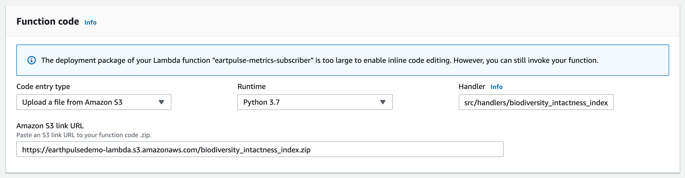

## marapp-workers
 
AWS Lambda workers for Marapp.

## Installation

```bash
$ make setup
```

A virtualenv will automatically be created, and packages from the [Pipfile](./Pipfile) installed.

## Running

Activate the virtualenv.

```bash
$ pipenv shell
```

To kill the virtualenv.

```bash
$ pipenv deactivate
```

The following environment variables are required by the service.

| **Key**                | **Description**                                                                      |
| ---------------------- |------------------------------------------------------------------------------------- |
| GOOGLE_SERVICE_ACCOUNT | GCP Service Account Private Key.                                                     |
| SERVICE_API_ENDPOINT   | API endpoint for [marapp-services](https://github.com/natgeosociety/marapp-services).|
| SERVICE_API_KEY        | API secret for [marapp-services](https://github.com/natgeosociety/marapp-services).  |
| SNS_RESULT_TOPIC_ARN   | Topic ARN from [marapp-services](https://github.com/natgeosociety/marapp-services).  |
| SENTRY_DSN             | (optional) Sentry DSN Key.                                                           |

## Packaging & deployment

Installs Serverless Framework and dependencies.

```bash
npm install
```

Create & deploy all required services. 

You will need an AWS access key ID and secret pair stored in `~/.aws/credentials`.

Alternatively, you can authenticate via the `AWS_ACCESS_KEY_ID` and `AWS_SECRET_ACCESS_KEY` environment variables.

You will need to have access to the following AWS services:
- CloudFormation

Create a local `.env` file based on [.env.sample](.env.sample), add the required configuration for the environment, and run:

```shell script
npm run serverless:deploy -- --stage <env>
```

#### Bundling resources manually (deprecated):

```bash
npm run package
```

Packages all Lambda functions configured in [serverless.yml](serverless.yml) and outputs them individually under the [vendor](vendor) directory.

The "filename.handler" path of the Lambda function which needs to be configured when deploying the function, is described in the [serverless.yml](serverless.yml) functions -> handler section.

Each zip containing the bundled libraries and code needs to be manually uploaded to an S3 bucket, then the path of the zip referenced in the Lambda configuration. 



Environment variables expected to be present in the Lambda function need to be manually configured.
